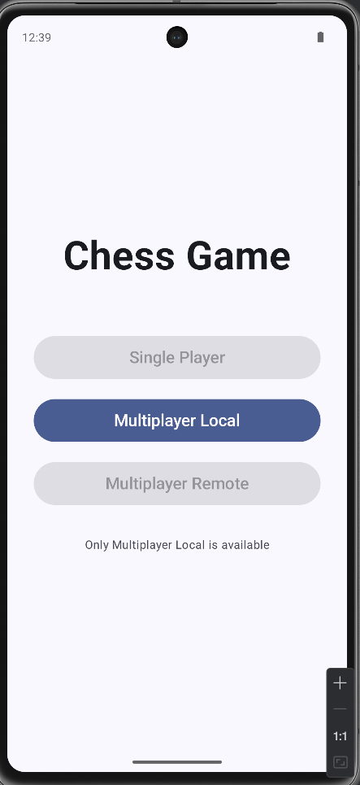
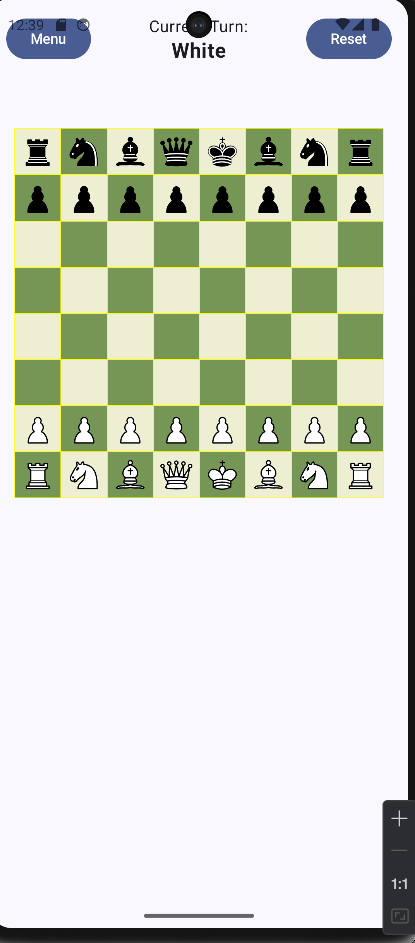
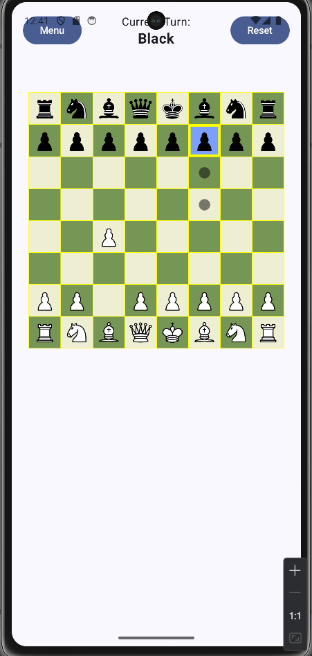
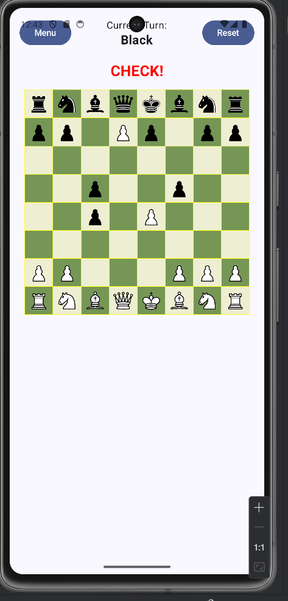
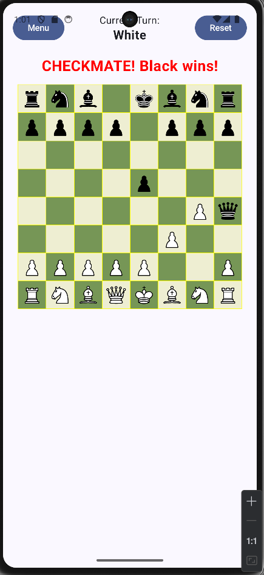

# Chess Mobile

A fully functional chess game application for Android, built with Kotlin and Jetpack Compose. This application implements all standard chess rules including special moves, check detection, and game state management.

## Table of Contents

- [Overview](#overview)
- [Features](#features)
- [Screenshots](#screenshots)
- [Architecture](#architecture)
- [Technologies](#technologies)
- [Requirements](#requirements)
- [Installation](#installation)
- [Project Structure](#project-structure)
- [Game Rules Implementation](#game-rules-implementation)
- [Contributing](#contributing)
- [License](#license)

## Overview

Chess Mobile is a native Android application that provides a complete chess gaming experience. The application allows two players to play chess locally on the same device, with a clean and intuitive interface built using Jetpack Compose's modern UI toolkit.

## Features

- **Complete Chess Rules Implementation**
  - All standard piece movements (Pawn, Rook, Knight, Bishop, Queen, King)
  - Special moves: Castling, En Passant, Pawn Promotion
  - Move validation and legal move highlighting
  - Check and checkmate detection
  - Stalemate detection

- **User Interface**
  - Modern Material Design 3 interface
  - Interactive chessboard with visual feedback
  - Move highlighting for selected pieces
  - Current turn indicator
  - Game state notifications (Check, Checkmate, Stalemate)
  - Game reset functionality

- **Game Management**
  - Local multiplayer (hot-seat mode)
  - Move history tracking
  - Complete game state management
  - Turn-based gameplay

## Screenshots

### Main Menu
The main menu screen showing game mode options.



### Game Board
The chess board during gameplay with pieces in their initial positions.



### Active Game
An active game with a piece selected and valid moves highlighted.



### Check State
The check notification when a king is in check.



### Checkmate
The checkmate notification and game end state.



## Architecture

The application follows the **MVVM (Model-View-ViewModel)** architecture pattern with clean separation of concerns:

### Layers

```
┌─────────────────────────────────────────┐
│           UI Layer (Compose)            │
│   - GameScreen, MenuScreen              │
│   - Composable components               │
└────────────────┬────────────────────────┘
                 │
┌────────────────▼────────────────────────┐
│         ViewModel Layer                 │
│   - ChessViewModel                      │
│   - UI State Management                 │
└────────────────┬────────────────────────┘
                 │
┌────────────────▼────────────────────────┐
│          Model Layer                    │
│   - ChessBoard (Game Logic)             │
│   - ChessPiece, Position                │
│   - Game State Management               │
└─────────────────────────────────────────┘
```

### Key Components

- **Model Layer**: Contains the core game logic and data structures
  - `ChessBoard`: Main game logic, move validation, check detection
  - `ChessPiece`: Piece representation with type, color, and state
  - `Position`: Board position utilities
  - `GameState`, `PieceType`, `PieceColor`: Enums for game state

- **ViewModel Layer**: Manages UI state and user interactions
  - `ChessViewModel`: Handles game state, move processing, and UI updates
  - `ChessUiState`: Immutable state representation for the UI

- **UI Layer**: Jetpack Compose-based interface
  - `GameScreen`: Main game board and controls
  - `MenuScreen`: Game mode selection
  - `NavigationGraph`: App navigation management

## Technologies

### Core Technologies

- **Language**: Kotlin 2.0.21
- **UI Framework**: Jetpack Compose with Material Design 3
- **Architecture**: MVVM with Kotlin Coroutines and Flow
- **Build System**: Gradle with Kotlin DSL

### Dependencies

```kotlin
- androidx.core:core-ktx:1.17.0
- androidx.lifecycle:lifecycle-runtime-ktx:2.9.4
- androidx.activity:activity-compose:1.11.0
- androidx.compose:compose-bom:2024.09.00
- androidx.compose.material3:material3
- androidx.lifecycle:lifecycle-viewmodel-compose:2.9.4
```

### Development Tools

- Android Gradle Plugin: 8.13.0
- Minimum SDK: 24 (Android 7.0)
- Target SDK: 36
- Compile SDK: 36
- Java Version: 11

## Requirements

- Android Studio Ladybug | 2024.2.1 or newer
- JDK 11 or higher
- Android SDK with minimum API level 24
- Kotlin 2.0.21 or compatible version

## Installation

### Clone the Repository

```bash
git clone https://github.com/IrminDev/Chess-Mobile.git
cd Chess-Mobile
```

### Open in Android Studio

1. Launch Android Studio
2. Select "Open an Existing Project"
3. Navigate to the cloned repository folder
4. Wait for Gradle sync to complete

### Build and Run

#### Using Android Studio

1. Connect an Android device or start an emulator
2. Click the "Run" button or press `Shift + F10`
3. Select your target device

#### Using Command Line

```bash
# Build the project
./gradlew build

# Install on connected device
./gradlew installDebug

# Build and install in one step
./gradlew installDebug
```

### Generate APK

```bash
# Debug APK
./gradlew assembleDebug

# Release APK (requires signing configuration)
./gradlew assembleRelease
```

The generated APK will be located at:
```
app/build/outputs/apk/debug/app-debug.apk
```

## Project Structure

```
Chess-Mobile/
├── app/
│   ├── src/
│   │   ├── main/
│   │   │   ├── java/com/github/irmin/chess/
│   │   │   │   ├── model/
│   │   │   │   │   ├── ChessBoard.kt       # Core game logic
│   │   │   │   │   ├── ChessPiece.kt       # Piece representation
│   │   │   │   │   ├── Position.kt         # Board positions
│   │   │   │   │   ├── Move.kt             # Move records
│   │   │   │   │   ├── PieceType.kt        # Piece types enum
│   │   │   │   │   ├── PieceColor.kt       # Color enum
│   │   │   │   │   └── GameState.kt        # Game state enum
│   │   │   │   ├── viewmodel/
│   │   │   │   │   └── ChessViewModel.kt   # Game state management
│   │   │   │   ├── ui/
│   │   │   │   │   ├── screens/
│   │   │   │   │   │   ├── GameScreen.kt   # Game UI
│   │   │   │   │   │   └── MenuScreen.kt   # Menu UI
│   │   │   │   │   ├── navigation/
│   │   │   │   │   │   └── NavigationGraph.kt
│   │   │   │   │   └── theme/              # App theming
│   │   │   │   └── MainActivity.kt         # Entry point
│   │   │   ├── res/
│   │   │   │   ├── drawable/               # Piece images
│   │   │   │   └── values/                 # Strings, colors, themes
│   │   │   └── AndroidManifest.xml
│   │   ├── test/                           # Unit tests
│   │   └── androidTest/                    # Instrumented tests
│   └── build.gradle.kts
├── gradle/
│   └── libs.versions.toml                  # Dependency versions
├── build.gradle.kts
├── settings.gradle.kts
└── README.md
```

## Game Rules Implementation

### Standard Moves

All chess pieces follow their traditional movement patterns:

- **Pawn**: Moves forward one square, two squares on first move, captures diagonally
- **Rook**: Moves horizontally or vertically any number of squares
- **Knight**: Moves in an L-shape (2 squares in one direction, 1 in perpendicular)
- **Bishop**: Moves diagonally any number of squares
- **Queen**: Combines rook and bishop movements
- **King**: Moves one square in any direction

### Special Moves

- **Castling**: King and rook swap positions under specific conditions
- **En Passant**: Special pawn capture move
- **Pawn Promotion**: Pawns reaching the opposite end can promote to Queen, Rook, Bishop, or Knight

### Game State Detection

- **Check**: Detects when a king is under attack
- **Checkmate**: Identifies when a player has no legal moves to escape check
- **Stalemate**: Recognizes when a player has no legal moves but is not in check

### Move Validation

The application validates all moves to ensure:
- Pieces move according to their rules
- Moves don't leave the king in check
- Path is clear for sliding pieces (Rook, Bishop, Queen)
- Special move conditions are met

## Contributing

Contributions are welcome! Please follow these guidelines:

1. Fork the repository
2. Create a feature branch (`git checkout -b feature/AmazingFeature`)
3. Commit your changes (`git commit -m 'Add some AmazingFeature'`)
4. Push to the branch (`git push origin feature/AmazingFeature`)
5. Open a Pull Request

### Code Style

- Follow Kotlin coding conventions
- Use meaningful variable and function names
- Add comments for complex logic
- Write unit tests for new features

## License

This project is available for educational and personal use. Please check with the repository owner for commercial use permissions.

---

**Author**: IrminDev  
**Repository**: [https://github.com/IrminDev/Chess-Mobile](https://github.com/IrminDev/Chess-Mobile)  
**Version**: 1.0
