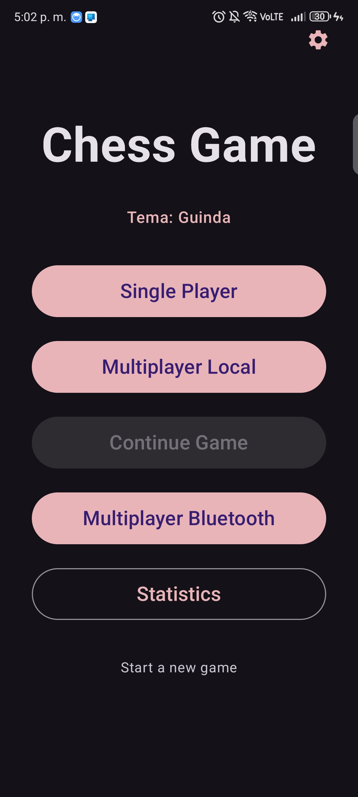
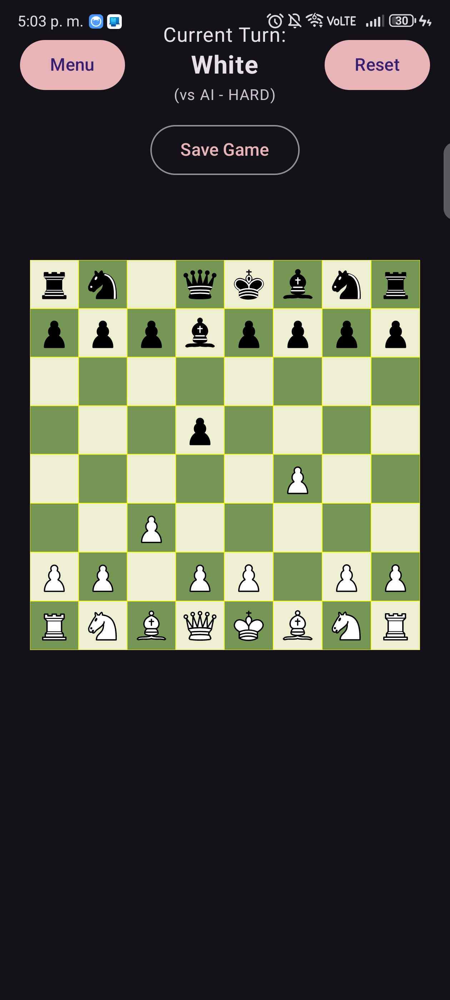
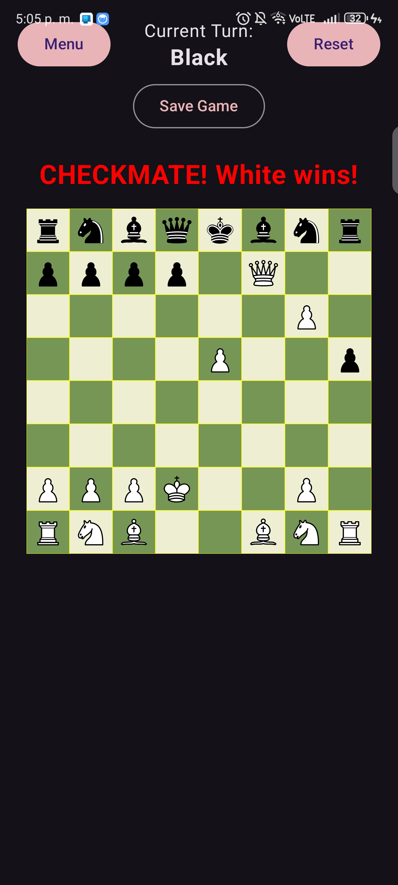
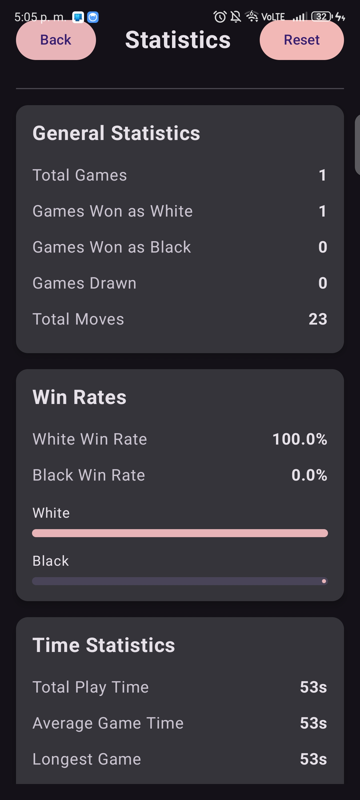

Chess is a lightweight Android chess app with a clean, touch-friendly board for playing games, a searchable match history for reviewing past play, and performance statistics to track improvement.  
   
 
